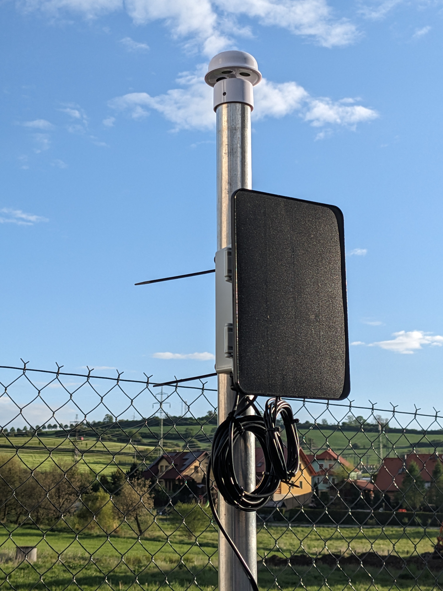

# Meteosonic LP

Low-power weather probe built around the LilyGO T-SIM7080-S3, an SDI-12 ultrasonic wind sensor, a 1S2P Li-ion battery pack, and a small solar panel. The firmware is written for ESP-IDF/PlatformIO. It continuously samples wind data through the ESP32-S3 ULP coprocessor and periodically publishes measurements through the SIM7080G NB-IoT modem using CoAP.

## Hardware



### Main Parts

| Part | Notes | Price |
| --- | --- | ---: |
| [LilyGO T-SIM7080-S3](https://lilygo.cc/en-us/products/t-sim7080-s3) | ESP32-S3, AXP2101 PMU, SIM7080G NB-IoT modem | 29.60 USD |
| [Ecosentec ES-W302](https://www.alibaba.com/product-detail/Ecosentec-2-in-1-Ultrasonic-Wind_1601484414461.html) | 2-in-1 ultrasonic wind sensor, SDI-12 | 65.00 USD |
| [GEB Li-ion 2x18650 1S2P 3.7 V 6400 mAh](https://www.laskakit.cz/geb-li-ion-baterie-2x18650-1s2p-3-7v-6400mah/) | Main battery pack, carefully chosen to have freeze protection. 1S3P is also an option | 14.41 USD |
| [5 V / 7 W solar panel](https://www.laskakit.cz/solarni-panel-5v-7w-s-drzakem-na-zed/) | Solar charging input, per T-SIM7080-S3 board specs | 29.40 USD |
| [150x100x70 mm IP67 enclosure](https://www.aliexpress.com/item/1005006800795068.html) | Outdoor plastic enclosure | 7.86 USD |
| [Waterproof DS18B20 temperature sensor, 1 m](https://www.laskakit.cz/dallas-digitalni-vodotesne-cidlo-teploty-ds18b20-1m/) | (optional) Ambient temperature measurement | 2.61 USD |
| [Weather-station sensor shield](https://www.laskakit.cz/kryt-pro-cidla-meteostanice--70x145mm--plast/) | (optional) Mechanical and radiation protection for the temperature sensor | 14.41 USD |
| Custom SDI-12 board, cable glands, connectors, 3D prints, glue, miscellaneous parts, shipping | JLCPCB, AliExpress, local parts | ~? USD |

Estimated base system cost: **~200 USD**.

### Mechanical Design

The probe is intended to live in an IP67 plastic enclosure. The solar panel is external, the wind sensor is mounted outside the enclosure, and cables enter through cable glands. The custom SDI-12 board, connector layout, 3D-printed parts, and final assembly photos will be documented later.

## Firmware

### Configuration

The main firmware parameters are configured in `platformio.ini` through `build_flags`:

| Macro | Current value | Meaning |
| --- | ---: | --- |
| `MODEM_WAKE_INTERVAL_SEC` | `59` | (s) Normal wake interval for publishing |
| `LOW_BATTERY_ENTER_MV` | `3600` | (mV) Enter low-battery guard below this battery voltage |
| `LOW_BATTERY_RECOVER_MV` | `3800` | (mV) Leave low-battery guard only after reaching this voltage |
| `LOW_BATTERY_CHECK_INTERVAL_SEC` | `1200` | (s) Check interval while in low-battery guard |
| `MODEM_APN` | `lpwa.vodafone.com` | NB-IoT APN |
| `COAP_SERVER` | `mqtt.analogic.cz` | CoAP endpoint |
| `COAP_PATH` | `/meteo-80B54EF07A78` | CoAP resource path |

### Boot Flow

On every boot, the firmware:

1. Detects whether the boot is cold, a normal deep-sleep wake, or a wake from low-battery guard.
2. Initializes I2C and the AXP2101 PMU.
3. Reads the battery voltage from the PMU.
4. Enters low-battery guard if the voltage is below the configured threshold.
5. Enables the modem, wind sensor, and level-conversion power rails.
6. Starts or reattaches to the ULP SDI-12 reader.
7. Runs the modem publishing cycle.
8. Chooses either normal sleep or low-battery sleep based on the battery voltage.

### Normal Measurement Cycle

In normal operation, the ULP RISC-V coprocessor talks to the SDI-12 wind sensor once per second and stores recent wind samples in a ring buffer. The main ESP32-S3 CPU wakes according to `MODEM_WAKE_INTERVAL_SEC`, reads a snapshot of the buffered wind data, reads the optional DS18B20 temperature sensor, and publishes a CoAP payload.

Published fields:

| JSON key | Meaning |
| --- | --- |
| `b` | Battery voltage (mV) |
| `t` | DS18B20 temperature (˚C), or `null` |
| `w` | Average wind speed (2 minutes average according to NOAA/WHO published once per minute, m/s) |
| `g` | 3-second gust (m/s) |
| `m` | 3-second minimum (m/s) |
| `d` | Average wind direction (˚) |

Example payload:

```json
{"b":3820,"t":12.34,"w":1.25,"g":2.10,"m":0.80,"d":246}
```

### Normal Sleep Between Measurements

After publishing, the firmware:

1. Puts the modem into DTR/CSCLK sleep mode.
2. Prepares the PMU for normal sleep.
3. Keeps `DC3`, `DC5`, and `BLDO1` enabled.
4. Keeps `RTC_PERIPH` enabled so the ULP can continue running.
5. Puts the main ESP32-S3 CPU into deep sleep for `MODEM_WAKE_INTERVAL_SEC`.

This mode is not meant to be the lowest possible current state. It is optimized for continuous wind sampling and faster modem recovery.

### Low-Battery Guard

The low-battery guard protects the battery from deeper discharge. It uses hysteresis:

| State | Condition |
| --- | --- |
| Enter guard | `VBAT < LOW_BATTERY_ENTER_MV` |
| Stay in guard after a check wake | `VBAT < LOW_BATTERY_RECOVER_MV` |
| Return to normal operation | `VBAT >= LOW_BATTERY_RECOVER_MV` |

When entering low-battery sleep, the firmware:

1. Stops the ULP SDI-12 reader.
2. Stops the modem UART driver.
3. Turns off the modem rail `DC3`.
4. Turns off the wind-sensor rail `DC5`.
5. Turns off the level-conversion rail `BLDO1`.
6. Turns off unused LDO/DCDC rails.
7. Deinitializes the PMU object and I2C bus.
8. Moves selected GPIOs into low-leakage states.
9. Enters deep sleep with `RTC_PERIPH` off.

In the current test variant, PMU battery detection and battery voltage ADC are left enabled during low-battery sleep. This avoids reading a stale VBAT register after wake. If lower sleep current is required, the PMU battery ADC can be disabled, but the next wake may report an old or delayed battery voltage.

### Known Tradeoffs

- `getBattVoltage()` from the AXP2101 should not be treated as an instant analog conversion. If the PMU battery ADC is disabled, it may return the last stored value.
- Low-battery mode disables ULP, so wind is not sampled while the battery is protected.
- After returning from power-cut sleep, the modem and ULP are initialized as fresh state instead of using the fast-resume path.
- Low-battery current depends heavily on GPIO states, level shifters, attached sensors, and whether current is measured through USB or directly from the battery path.

## Development

Build:

```sh
pio run
```

Upload:

```sh
pio run --target upload
```

## TODO

- Document the custom SDI-12 board schematic.
